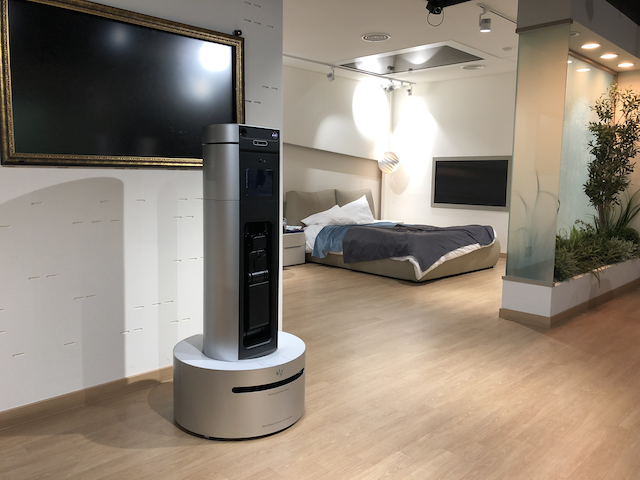

# ZipSa

ZipSa that is developed by KIST is the indoor service robot for providing some services (elderly care, run an errand, etc) in living lab.)

## Specifications

- **Living Lab Robot V2**
    - Size: 690 x 690 x 1500 (mm)
    - Omnidirectional Drive
    - Rotate Body
    - Rotate Head with Tilting
    - 7 Axis Arm with Gripper
    - 10” screen
    - Speech recognition
    - Text to Speech
    - 2x Lidars (Front/Rear)
    - 2x PCs
    - RGBD Camera
    - Projector with RGB Camera