# Teardown the Cases of ZipSa

For maintain or change the parts inside robot, you can teardown the case of robot by this procedure as shown below.

1. **Front cover of mobile base**. Release the screws bottom side of mobile base.

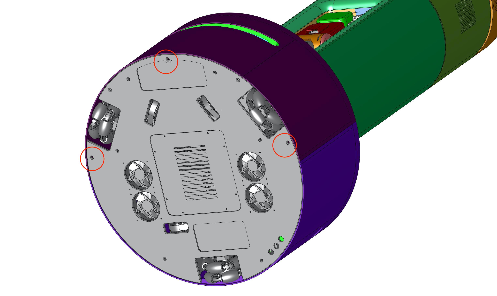
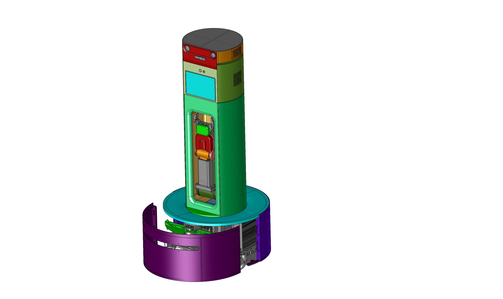

2. **Back cover of mobile base**. Just pull back. This cover attached by magnetic.

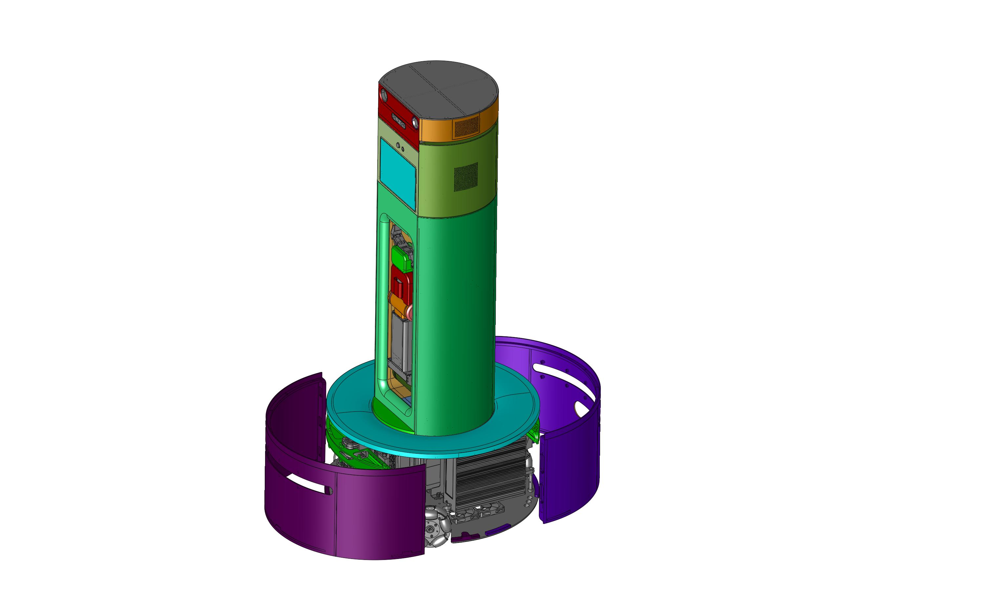

3. **Head top cover**. Lift up the head cover. It is attached by magnetic.

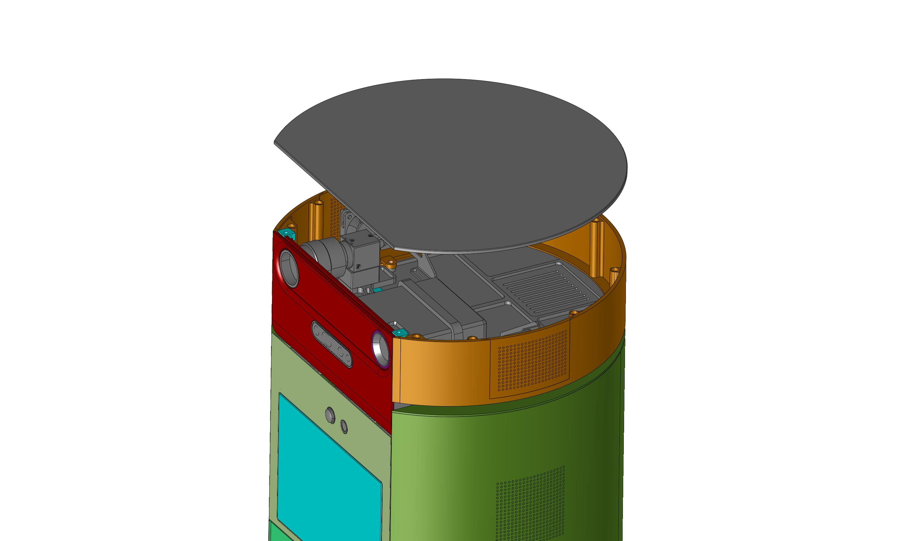

4. **Head cover**. Spread from side to side and pull back.

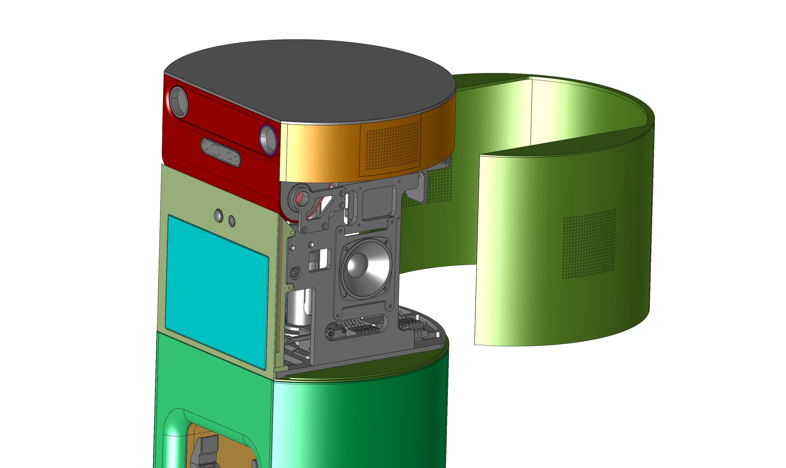

5. **Body cover**. Release the 4 screws which located top of body cover.

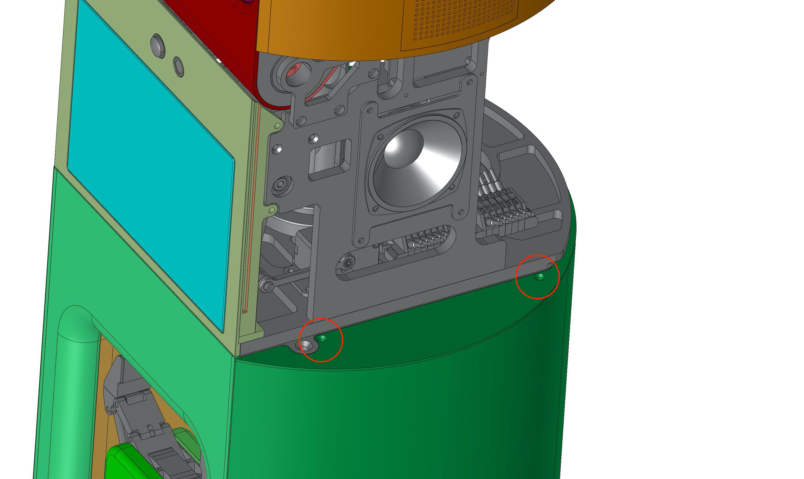
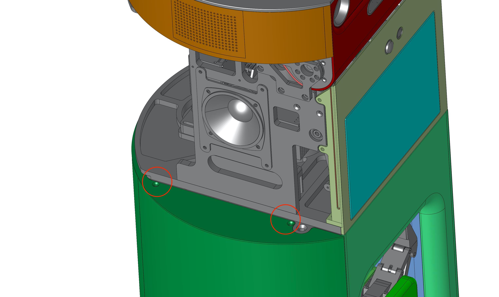

And, spread from side to side and pull back. While pull back, please watch out the connector (emergency switch). Disconnect the connector while tear down.

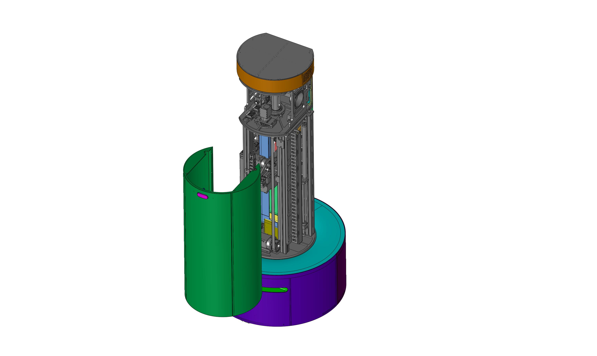

6. **Lamp cover**. Disconnect the connector in mobile base.

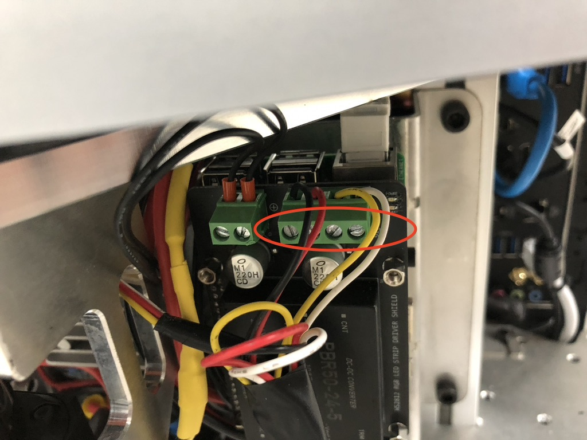

And, lift up the cover along the body.

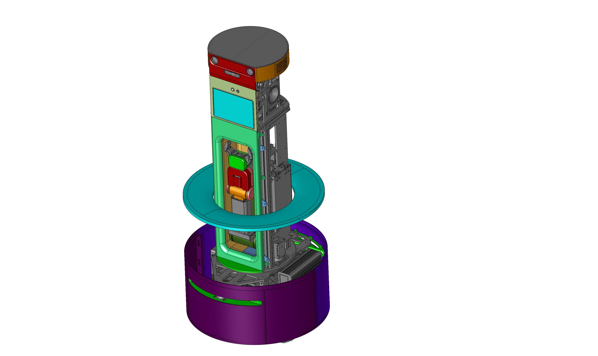

7. **Body front cover**. Release 8 screws. Pull back the cover.

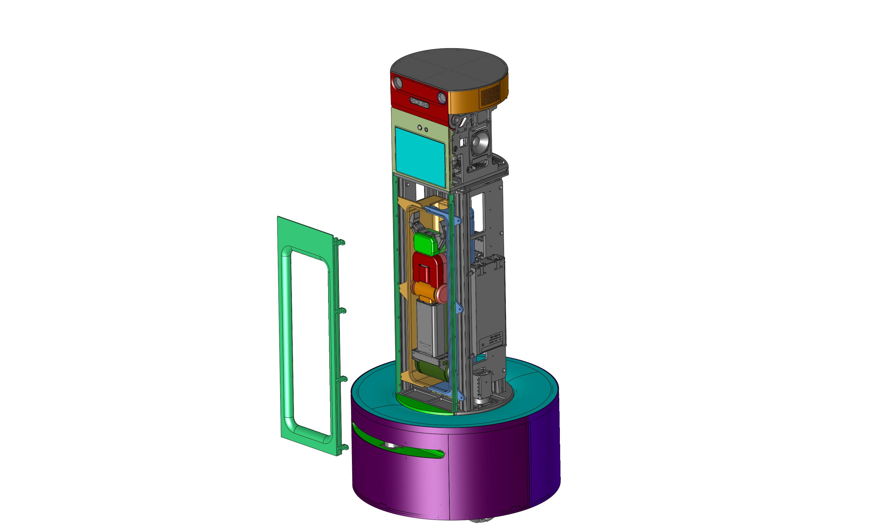

8. **Body front-inside cover**. Release 6 screws. Pull back the cover. It consist of two parts.

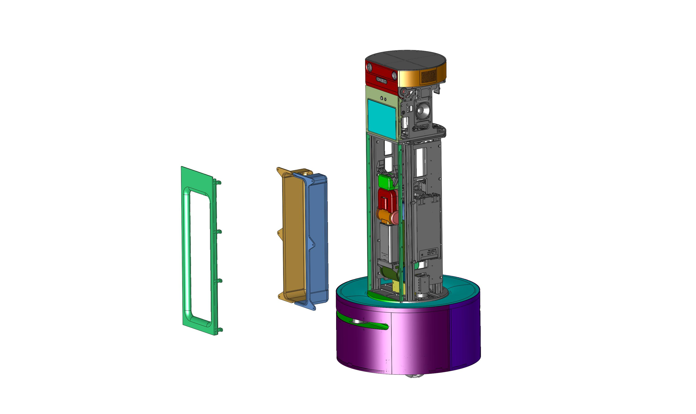