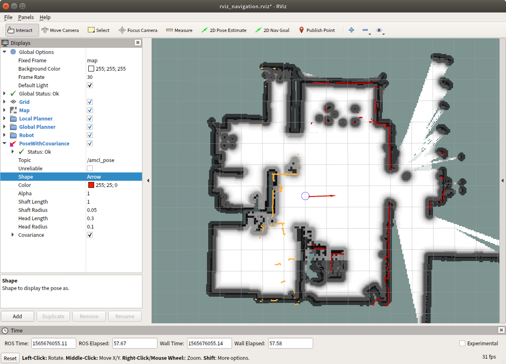

# Troubleshootings

## 원점이 아닌 곳에서 로봇 bringup을 실행할 경우.

원격pc에서 로봇을 연결하여 로봇의 현재 위치를 지정해준다.

    $ export ROS_MASTER_URI=http://robot-v2-livinglab:11311
    $ roscd living_lab_robot_navigation/
    $ rviz -d rviz_navigation.rviz

상단의 툴바 중, 2D Pose Estimate를 이용하여 로봇의 현재 위치를 대략적으로 지정해준다. 다음으로 조이스틱을 이용하여 로봇을 회전, 이동하여 로봇의 현재 위치를 수렴하도록 한다.

## 초기화 과정 혹은 동작 중 에러가 발생하였을 경우.

로봇의 등 뒤에 있는 Emergency 버튼을 눌러 로봇을 정지한다. 이때 모든 모터의 토크가 풀리므로, 팔과 몸통간의 충돌이 발생하지 않도록 팔을 잡아준다. 다시 Emergency를 해제하고 (다시 버튼을 누름) 초기화 과정을 반복한다.

## 조이스틱이 동작하지 않는 경우

먼저 충전 여부를 확인하고, 그래도 안되는 경우 조이스틱의 PS로고 버튼을 장시간 눌러 전원을 끄고, 다시 로고 버튼을 눌러 켜고, 로봇에 접속 유무를 확인한다.

